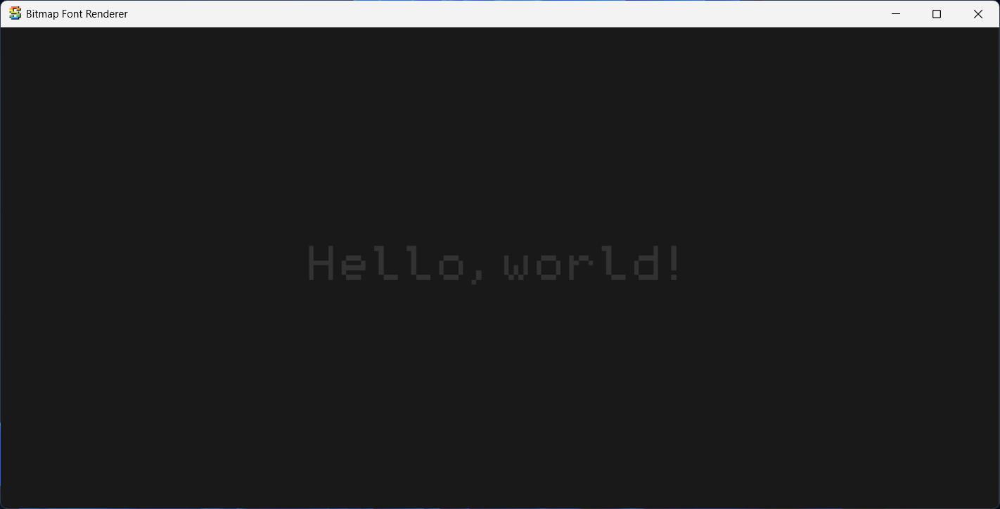

# Sokol Bitmap Font

Minimal bitmap font rendering for Sokol GP

## Overview

`sokol_bitmap_font` is a lightweight header-only C library for drawing bitmap fonts in [Sokol](https://github.com/floooh/sokol) applications using the [Sokol GP](https://github.com/edubart/sokol_gp) 2D graphics API. It allows you to render text using a pre-generated bitmap font atlas, leveraging Sokol GP's batching and draw functions for efficient rendering.

## Features

- Draw individual characters or entire strings using a bitmap font atlas
- Integrates directly with Sokol GP's draw functions (`sgp_draw_textured_rect`)
- Simple API for font initialization and cleanup
- Customizable character size, padding, and atlas layout
- No dynamic allocations during rendering

## Getting Started

### 1. Add the library

Copy `sokol_bitmap.h` into your project. Make sure you have Sokol headers (`sokol_gfx.h`, `sokol_gp.h`, etc.) available.

To include the implementation, **define `SOKOL_BITMAP_IMPL` in exactly one `.c` file**, like so:

```c
// sokol.c or main.c
#define SOKOL_BITMAP_IMPL
#include "sokol_bitmap.h"
```

In all other files, simply:

```c
#include "sokol_bitmap.h"
```

This ensures the implementation is only compiled once. See [`example/sokol.c`](example/sokol.c) for how this is done.

### 2. Prepare a bitmap font atlas

Create a PNG image containing all glyphs arranged in a grid. You will need to know the width/height of each glyph and the padding between them.

### 3. Initialize the font

```c
#include "sokol_bitmap.h"

// Load your font texture as sg_image (using stb_image or similar)
sbm_desc desc = {
    .img = my_font_texture,
    .img_width_pixels = ...,
    .img_height_pixels = ...,
    .img_padding_x_pixels = ...,
    .img_padding_y_pixels = ...,
    .char_width_pixels = ...,
    .char_height_pixels = ...,
    .char_padding_x_pixels = ...,
    .char_padding_y_pixels = ...,
    .chars = "ABCDEFGHIJKLMNOPQRSTUVWXYZabcdefghijklmnopqrstuvwxyz0123456789...",
    .num_chars = strlen(chars),
};

sbm_font font;
sbm_init_font(&font, desc);
```

### 4. Draw text

Call `sbm_draw_char` or `sbm_draw_string` inside your frame rendering function:

```c
const char *s = ...;
sbm_draw_opts opts = {
    .string = s,
    .string_len = strlen(s),
    .font_size = ...,
    .gap = ...,
};

sbm_draw_string(&font, opts);
```

### 5. Cleanup

```c
sbm_free_font(&font);
```

## API Reference

See [`sokol_bitmap.h`](sokol_bitmap.h) for full API documentation.

- `bool sbm_init_font(sbm_font *self, sbm_desc desc);`
- `void sbm_free_font(sbm_font *self);`
- `void sbm_draw_char(sbm_font *self, char c, sgp_rect r);`
- `void sbm_draw_string(sbm_font *self, sbm_draw_opts opts);`
- `float sbm_measure_string(sbm_font *self, sbm_draw_opts opts);`

## Example

See [`example/main.c`](example/main.c) for a complete usage example.



**Font Attribution:**  
The font used in the example is [**Minogram 6x10**](https://frostyfreeze.itch.io/pixel-bitmap-fonts-png-xml) by frostyfreeze on itch.io.

## License

This library is released under the zlib/libpng license, same as Sokol.

---

**Links**

- [Sokol GFX](https://github.com/floooh/sokol)
- [Sokol GP](https://github.com/edubart/sokol_gp)
